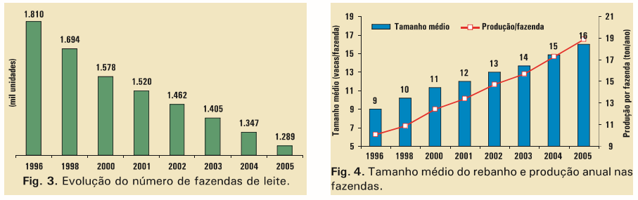

```{r setup, include=FALSE, message=FALSE, warning=FALSE}
library(flexdashboard)
library(ggplot2)
library(dplyr)
library(tidyr)
library(plotly)
library(geobr)
library(sf)
knitr::opts_chunk$set(echo = FALSE)
knitr::opts_chunk$set(message = FALSE, warning = FALSE)

dados <- read.csv2("dados.csv")
dados$ano <- as.factor(dados$ano)
dados$mes <- as.factor(dados$mes)

dados_long <- dados %>%
  pivot_longer(cols = -c(ano, mes), names_to = "estado", values_to = "producao")

# Calcular a média anual para cada estado
media_anual <- dados_long %>%
  group_by(ano, estado) %>%
  summarise(media_producao = mean(producao, na.rm = TRUE))

estados <- c("Amazonas","Roraima","acre","alagoas","bahia","ceara",
             "df","es","goias","maranhao","mg","ms","mt","para",
             "paraiba","parana","pernambuca","piaui","rg","rj",
             "rn","rondonia","sc","sergipe","sp","tocantins")

list_of_graficos <- NULL

soma_anual_nacional <- dados_long %>%
  group_by(ano) %>%
  summarise(producao_total_nacional = sum(producao, na.rm = TRUE)/1000000)

for (estadoss in estados) {
  graficos <- ggplot() +
    geom_point(data = dados_long %>% filter(estado == estadoss), aes(x = as.factor(ano), y = producao/100000), color = "blue", alpha = 0.6) +
    geom_line(data = media_anual %>% filter(estado == estadoss), aes(x = as.factor(ano), y = media_producao/100000, group = 1), color = "red", size = 1) +
    labs(x = "Ano",
         y = expression("Leite cru (" ~ 10^8 ~ " litros)")) +
    theme_bw() +
    theme(axis.text.x = element_text(angle = 45, hjust = 1))


  list_of_graficos[[estadoss]] <- graficos
}

soma_anual <- dados_long %>%
  group_by(ano, estado) %>%
  summarise(producao_total = sum(producao, na.rm = TRUE)/1000000)

list_of_graficos_soma <- NULL

for (estadoss in estados) {
  graficos_soma <- ggplot() +
    geom_point(data = soma_anual %>% filter(estado == estadoss), aes(x = as.factor(ano), y = producao_total*10), color = "blue", alpha = 0.6) +
    geom_line(data = soma_anual %>% filter(estado == estadoss), aes(x = as.factor(ano), y = producao_total*10, group = 1), color = "red", size = 1) +
    labs(x = "Ano",
         y = expression("Leite cru (" ~ 10^8 ~ " litros)")) +
    theme_bw() +
    theme(axis.text.x = element_text(angle = 45, hjust = 1))

  list_of_graficos_soma[[estadoss]] <- graficos_soma
}

graficos_soma_nacional <- ggplot() +
  geom_point(data = soma_anual_nacional, aes(x = as.factor(ano), y = producao_total_nacional), color = "blue", alpha = 0.6) +
  geom_line(data = soma_anual_nacional, aes(x = as.factor(ano), y = producao_total_nacional, group = 1), color = "red", size = 1) +
  labs(x = "Ano",
       y = expression("Leite cru (" ~ 10^9 ~ " litros)")) +
  theme_bw() +
  theme(axis.text.x = element_text(angle = 45, hjust = 1))+
  scale_y_continuous(limits = c(10,28), breaks = seq(10,28, by = 3))

graficos_soma_nacional_1 <- ggplot() +
  geom_point(data = soma_anual,
             aes(x = as.factor(ano),
                 y = producao_total,
             group = estado, color = estado),
             alpha = 0.6) +
  geom_point(data = soma_anual_nacional, aes(x = as.factor(ano), y = producao_total_nacional), color = "blue", alpha = 0.6) +
  geom_line(data = soma_anual_nacional, aes(x = as.factor(ano), y = producao_total_nacional, group = 1), color = "red", size = 1) +
  labs(x = "Ano",
       y = expression("Leite cru (" ~ 10^9 ~ " litros)")) +
  theme_bw() +
  theme(axis.text.x = element_text(angle = 45, hjust = 1),
        legend.position = "bottom")+
  scale_color_discrete(labels = c("sp" = "São Paulo",
                                "mg" = "Minas Gerais",
                                "rj" = "Rio de Janeiro",
                                "acre" = "Acre",
                                "alagoas" = "Alagoas",
                                "bahia", "Bahia",
                                "ceara" = "Ceará",
                                "df" = "Distrito Federal",
                                "es" = "Espírito Santo",
                                "goias"= "Goiás",
                                "maranhao"= "Maranhão",
                                "ms"= "Mato Grosso do Sul",
                                "mt"= "Mato Grosso",
                                "para"= "Pará",
                                "paraiba"="Paraíba",
                                "parana"= "Paraná",
                                "pernambuca"="Pernambuco",
                                "piaui"="Piauí",
                                "rg"="Rio Grande do Sul",
                                "rn"="Rio Grande do Norte",
                                "rondonia"="Rondônia",
                                "sc"="Santa Catarina",
                                "sergipe"="Sergipe",
                                "tocantins"="Tocantins"))+
  scale_y_continuous(limits = c(0,27), breaks = seq(0,27, by = 3))

graficos_soma_estadual <- ggplot() +
  geom_point(data = soma_anual,
             aes(x = as.factor(ano),
                 y = producao_total,
                 group = estado, color = estado),
             alpha = 0.6) +
  geom_line(data = soma_anual,
            aes(x = as.factor(ano),
                y = producao_total,
                group = estado,
                color = estado), size = 1) +
  labs(x = "Ano",
       y = expression("Leite cru (" ~ 10^9 ~ " litros)")) +
  theme_bw() +
  theme(axis.text.x = element_text(angle = 45, hjust = 1),
        legend.position = "bottom")+
  scale_color_discrete(labels = c("sp" = "São Paulo",
                                  "mg" = "Minas Gerais",
                                  "rj" = "Rio de Janeiro",
                                  "acre" = "Acre",
                                  "alagoas" = "Alagoas",
                                  "bahia", "Bahia",
                                  "ceara" = "Ceará",
                                  "df" = "Distrito Federal",
                                  "es" = "Espírito Santo",
                                  "goias"= "Goiás",
                                  "maranhao"= "Maranhão",
                                  "ms"= "Mato Grosso do Sul",
                                  "mt"= "Mato Grosso",
                                  "para"= "Pará",
                                  "paraiba"="Paraíba",
                                  "parana"= "Paraná",
                                  "pernambuca"="Pernambuco",
                                  "piaui"="Piauí",
                                  "rg"="Rio Grande do Sul",
                                  "rn"="Rio Grande do Norte",
                                  "rondonia"="Rondônia",
                                  "sc"="Santa Catarina",
                                  "sergipe"="Sergipe",
                                  "tocantins"="Tocantins"))+
  scale_y_continuous(limits = c(0,7), breaks = seq(0,7, by = 1))

ANO_2023 <- filter(soma_anual, ano==2023)
grafico_estados <- ggplot(ANO_2023, aes(y = producao_total, x = estado, fill = estado)) +
  geom_bar(stat = "identity")+
  labs(x = "Estados",
       y = expression("Leite cru (" ~ 10^9 ~ " litros)")) +
  theme_bw() +
  theme(axis.text.x = element_text(angle = 45, hjust = 1),
         legend.position = "none")+
  scale_fill_discrete(labels = c("sp" = "São Paulo",
                                  "mg" = "Minas Gerais",
                                  "rj" = "Rio de Janeiro",
                                  "acre" = "Acre",
                                  "alagoas" = "Alagoas",
                                  "bahia", "Bahia",
                                  "ceara" = "Ceará",
                                  "df" = "Distrito Federal",
                                  "es" = "Espírito Santo",
                                  "goias"= "Goiás",
                                  "maranhao"= "Maranhão",
                                  "ms"= "Mato Grosso do Sul",
                                  "mt"= "Mato Grosso",
                                  "para"= "Pará",
                                  "paraiba"="Paraíba",
                                  "parana"= "Paraná",
                                  "pernambuca"="Pernambuco",
                                  "piaui"="Piauí",
                                  "rg"="Rio Grande do Sul",
                                  "rn"="Rio Grande do Norte",
                                  "rondonia"="Rondônia",
                                  "sc"="Santa Catarina",
                                  "sergipe"="Sergipe",
                                  "tocantins"="Tocantins"))+
  scale_x_discrete(labels = c("sp" = "São Paulo",
                              "mg" = "Minas Gerais",
                              "rj" = "Rio de Janeiro",
                              "acre" = "Acre",
                              "alagoas" = "Alagoas",
                              "bahia" = "Bahia",
                              "ceara" = "Ceará",
                              "df" = "Distrito Federal",
                              "es" = "Espírito Santo",
                              "goias" = "Goiás",
                              "maranhao" = "Maranhão",
                              "ms" = "Mato Grosso do Sul",
                              "mt" = "Mato Grosso",
                              "para" = "Pará",
                              "paraiba" = "Paraíba",
                              "parana" = "Paraná",
                              "pernambuca" = "Pernambuco",
                              "piaui" = "Piauí",
                              "rg" = "Rio Grande do Sul",
                              "rn" = "Rio Grande do Norte",
                              "rondonia" = "Rondônia",
                              "sc" = "Santa Catarina",
                              "sergipe" = "Sergipe",
                              "tocantins" = "Tocantins"))+
   scale_y_continuous(limits = c(0,6), breaks = seq(0,6, by = 1))

maiores_prod <- filter(soma_anual, estado %in% c("mg", "sp", "sc", "rg", "parana"))

graficos_soma_estadual_1 <- ggplot() +
  geom_point(data = maiores_prod,
             aes(x = as.factor(ano),
                 y = producao_total,
                 group = estado, color = estado),
             alpha = 0.6) +
  geom_line(data = maiores_prod,
            aes(x = as.factor(ano),
                y = producao_total,
                group = estado,
                color = estado), size = 1) +
  labs(x = "Ano",
       y = expression("Leite cru (" ~ 10^9 ~ " litros)")) +
  theme_bw() +
  theme(axis.text.x = element_text(angle = 45, hjust = 1),
        legend.position = "bottom")+
  scale_color_manual(values= c("sp" = "pink",
                                  "mg" = "green",
                                  "parana"= "lightblue",
                                  "rg"="purple",
                                  "sc"="#f17") ,
                       labels = c("sp" = "São Paulo",
                                  "mg" = "Minas Gerais",
                                  "parana"= "Paraná",
                                  "rg"="Rio Grande do Sul",
                                  "sc"="Santa Catarina"))+
  scale_y_continuous(limits = c(0,7), breaks = seq(0,7, by = 1))

```

# Cenário Nacional {data-icon="fa-earth-americas"}

## Column {data-width="450"}

### Brasil
<div style="text-align: justify;">
|      A produção de leite no Brasil aumentou expressivamente do período de 1997 até 2014 saindo de aproximadamente 11 bilhões de litros e atingindo 25 bilhões de litros, um aumento de 127%. Entretanto, o recorte dos últimos 10 anos é de estabilidade. Cabe destacar que, no gráfico observado na aba "Captação total", o valor assumido para 2024 está subestimado haja vista que a produção registrada foi somente até junho, faltanto os resultados do segundo semestre. Ao estipular um valor preditivo com base nas médias dos estados (que podem ser observados ao longo dessa pesquisa) a captação de leite deve ficar por volta de 23 bilhões de litros em 2024.
|     Em 2017 houve uma ligeira queda, porém segundo a circular técnica 118 da Embrapa: "O mercado do leite de 2017" o cenário econômico foi favorável em 2017 quando comparado a 2016, por isso uma hipótese é que essas ligeiras mudanças observadas são normais da oscilão do mercado, no entanto deve-se realizar um estudo mais aprofundado para analisar o que realmente ocorreu nesse ano.
|     No gráfico "Captação por estados" houve uma decomposição da captação total por estados brasileiros mais o Distrito Federal, o destaque está para Minas Gerais, maior estado produtor, que atualmente contribui com aproximadamente um terço da captação total. A atuação dos estados podem ser exploradas na aba "Estados".
</div>
## Column {data-width=550} {.tabset}

### Mapa

```{r}
mapa_brasil <- read_state(year = 2020)
ANO_2023$Estados <- c("AM","RR","AC","AL","BA","CE","DF","ES","GO","MA","MG","MS","MT","PA","PB","PR","PE","PI","RS","RJ","RN","RO","SC","SE","SP","TO")
mapa_dados <- mapa_brasil %>%
  left_join(ANO_2023, by = c("abbrev_state" = "Estados"))

ggplot(mapa_dados) +
  geom_sf(aes(fill = producao_total), color = "white") +  # 'valor_producao' é a coluna de dados
  scale_fill_viridis_c(option = "turbo") +  # Ajustar escala de cores conforme necessário
  theme_minimal() +
  labs(title = "Produção por Estado",
       fill = "Produção")


```

### Captação total

```{r}
graficos_soma_nacional
```

### Captação por estados

```{r}
graficos_soma_estadual
```

# Estados {data-icon="fa-signal"}

## Coluna {data-width="650"}

### Macrorregiões
<div style="text-align: justify;">
|     Os estados líderes são: Minas Gerais, Paraná, Rio Grande do Sul, Santa Catarina, São Paulo e Goiás, como pode ser observado no gráficos. Cabe destacar a região sul figurando entre os maiores produtores, o clima é propício para a criação de bovinos leiteiros taurinos como por exemplo a raça holandesa, por serem originárias de regiões clima mais ameno o gado leiteiro no Brasil sente-se mais confortável em regiões edafoclimáticas mais parecidas com o original.
|    Cada um dos estados citados terão uma aba especial em "Ranking dos maiores produtores".
|   Outro fato relevante está na diminuição do número de fazendas, porém com um acréscimo no tamanho das fazendas e na produção, ou seja, o pequeno produtor está perdendo espaço no cenário leiteiro do Brasil.
</div>

### Número e tamanho de fazendas (1996-2005) (Fonte: Embrapa)

[{width="630"}](https://ainfo.cnptia.embrapa.br/digital/bitstream/doc/595794/1/Producao-de-leite-no-Brasil.pdf)

## Coluna {data-width=650} {.tabset}

### Captação em 2023

```{r}
grafico_estados
```

### Histórico da captação

```{r}
graficos_soma_estadual_1
```

# 1º Minas Gerais {data-navmenu="Ranking dos maiores produtores"}

## Coluna {data-width="650"}

### Minas Gerais
<div style="text-align: justify;">
|     A produção mineira de leite é destaque no Brasil desde muito tempo, vale lembrar da política do "Café com Leite" pré Getúlio Vargas, em que o presidente da República era mineiro, regido pelos coronéis das fazendas de gado leiteiro ou paulista escolhido pelos cafeicultures.
|    O recorte mais recente não é diferente, a captação de leite saltou de 2,8 bilhões de litros para 6,8 bilhões de litros em 2014, tendo uma ligeira queda em 2017, volta em 2020 e queda novamente em 2022 e 2023.
</div> 
### Representação na captação nacional (2023)

```{r}
gauge(28, min = 0, max = 100, symbol = '%', gaugeSectors(
  success = c(5, 100), warning = c(3, 4), danger = c(0, 2), colors = c("darkgreen", "yellow", "red")
))
```

## Coluna {data-width=650} {.tabset}

### Média

```{r}
list_of_graficos$mg
```

### Total

```{r}
list_of_graficos_soma$mg+
               scale_y_continuous(limits = c(28,68), breaks = seq(28,68, by = 10))
```

# 2º Paraná {data-navmenu="Ranking dos maiores produtores"}

## Coluna {data-width="650"}

### Paraná
<div style="text-align: justify;">
|    A produção total aumentou de 0,8 bilhões de litros para 3,6 bilhões, um crescimento de 4,5 vezes. A captação média está em volta de 0,3 bilhões de litros por mês. Segundo a secretaria de agricultura e abastecimento, o estado tem aproximadamente 87 mil produtores. Sendo esse produto o quarto do ranking que mais contribui para a econômia do estado. Em 2022 a produção rendeu 11,4 bilhões de reais. Veja a reportagem completa no link abaixo.  

https://www.aen.pr.gov.br/Noticia/Estado-apresenta-novas-medidas-de-apoio-aos-produtores-de-leite-em-Londrina#:~:text=O%20Paraná%20é%20o%20segundo,bilhões%20de%20litros%20ao%20ano.
</div>
### Representação na captação nacional (2023)

```{r}
gauge(14, min = 0, max = 100, symbol = '%', gaugeSectors(
  success = c(5, 100), warning = c(3, 4), danger = c(0, 2), colors = c("darkgreen", "yellow", "red")
))
```

## Coluna {data-width=650} {.tabset}

### Média

```{r}
list_of_graficos$parana+scale_y_continuous(limits = c(0,4), breaks = seq(0,4, by = 1))
```

### Total

```{r}
list_of_graficos_soma$parana+scale_y_continuous(limits = c(0,40), breaks = seq(0,40, by = 8))
```

# 3º Santa Catarina {data-navmenu="Ranking dos maiores produtores"}

## Coluna {data-width="650"}

### Santa Catarina
<div style="text-align: justify;">
|    Em Santa Catarina a captação de leite foi de quase zero em 1997 para 3,2 bilhões de litros em 2024 com tendência de crescimento.
|    A grande parte da cadeia produtiva é movida por agricultura familiar e será lançado um projeto para fomentar ainda mais esse produto. Veja reportagem em: "Governo do Estado lança o Programa Leite Bom SC para apoiar cadeia produtiva catarinense" 

https://www.epagri.sc.gov.br/index.php/2024/04/22/governo-do-estado-lanca-o-programa-leite-bom-sc-para-apoiar-cadeia-produtiva-catarinense/
</div>
### Representação na captação nacional (2023)

```{r}
gauge(13, min = 0, max = 100, symbol = '%', gaugeSectors(
  success = c(5, 100), warning = c(3, 4), danger = c(0, 2), colors = c("darkgreen", "yellow", "red")
))
```

## Coluna {data-width=650} {.tabset}

### Média

```{r}
list_of_graficos$sc
```

### total

```{r}
list_of_graficos_soma$sc
```

# 4º Rio Grande do Sul {data-navmenu="Ranking dos maiores produtores"}

## Coluna {data-width="650"}

### Rio Grande do Sul
<div style="text-align: justify;">
|    No estado do Rio Grande do Sul o pico de produção do desde 1997 foi em 2012 com um crescimento de cerca de 190% indo de 1,2 bilhões de litros para próximo de 3,5 bilhões de litros. De 2012 até 2023 houve uma ligeira tendência de queda, utilizando a média obtida no início de 2024 pode-se acreditar em um pequeno decréscimo neste ano em comparação ao ano anterior.
</div>
### Representação na captação nacional (2023)

```{r}
gauge(12, min = 0, max = 100, symbol = '%', gaugeSectors(
  success = c(5, 100), warning = c(3, 4), danger = c(0, 2), colors = c("darkgreen", "yellow", "red")
))
```

## Coluna {data-width=650} {.tabset}

### Média

```{r}
list_of_graficos$rg+scale_y_continuous(limits = c(0.5,3.5), breaks = seq(0.5,3.5, by = 0.5))
```

### Total

```{r}
list_of_graficos_soma$rg
```

# 5º São Paulo {data-navmenu="Ranking dos maiores produtores"}

## Coluna {data-width="650"}

### São Paulo
<div style="text-align: justify;">
|     Em São Paulo também houve um crescimento de 1997 à 2017 (pico da captação de leite cru), porém menor quando comparado com os outros estados, somente 40%. Além disso há uma flagrante queda desde 2017 com tendência de diminuir ainda mais em 2024. Há uma provável perda de colocação no ranking de São Paulo com uma ascenção do estado de Goiás.
|     Um dos motivos da queda em São Paulo pode estar relacionado à venda de espaços rurais para galpões e condomínios. Cabe ressaltar que a venda de terra no meio rural é baseada no hectare (10 mil metros quadrados), porém para galpões e condomínios a terra é vendida por metro quadrado, ficando mais atrativo ao produtor ganhar dinheiro com a venda da terra do que com a produção, exercendo o custo de oportunidade da terra.
</div>
### Representação na captação nacional (2023)

```{r}
gauge(9, min = 0, max = 100, symbol = '%', gaugeSectors(
  success = c(5, 100), warning = c(3, 4), danger = c(0, 2), colors = c("darkgreen", "yellow", "red")
))
```

## Coluna {data-width=650} {.tabset}

### Média

```{r}
list_of_graficos$sp+scale_y_continuous(limits = c(1.2,2.7), breaks = seq(1.2,2.7, by = 0.3))
```

### Total

```{r}
list_of_graficos_soma$sp+scale_y_continuous(limits = c(10,30), breaks = seq(10,30, by = 5))
```
